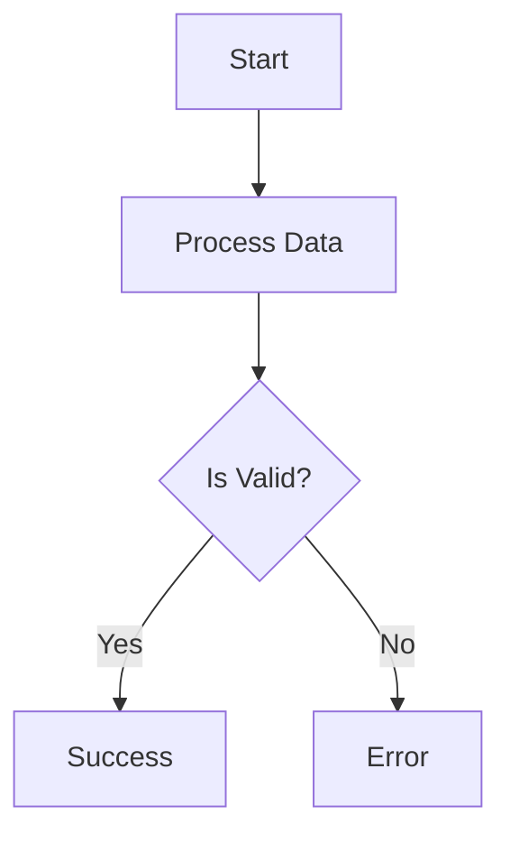

# AgenticAI ReactFlow Platform

A lightweight internal platform for creating, managing, and publishing interactive flowcharts using Mermaid syntax and React Flow visualization.

## Features

- ✅ **Mermaid Editor** - Create flowcharts using familiar Mermaid Markdown syntax
- ✅ **Live Preview** - Real-time rendering as you type
- ✅ **Auto-save** - Never lose your work
- ✅ **Public Publishing** - Share flowcharts via SSR-rendered React Flow pages
- ✅ **SQLite Database** - Self-contained, no external dependencies
- ✅ **Authentication** - Secure authentication with Clerk
- ✅ **Modern UI** - Clean, responsive interface

## Tech Stack

- **Frontend**: Next.js 15 (App Router), React 19, TypeScript
- **Styling**: Tailwind CSS
- **Database**: SQLite with Drizzle ORM
- **Auth**: Clerk
- **Visualization**:
  - Mermaid.js (editor preview)
  - React Flow (published pages)

## Quick Start

### Prerequisites

- Node.js 18+ installed
- npm or yarn

### Installation

**Quick Setup (Recommended)**
```bash
# Run the setup script - handles everything automatically
chmod +x scripts/setup.sh
./scripts/setup.sh
```

**Manual Setup**

1. **Clone and install dependencies**
   ```bash
   npm install
   ```

2. **Set up environment variables**
   ```bash
   # Copy the example file
   cp .env.example .env.local

   # Get your Clerk API keys from: https://dashboard.clerk.com/last-active?path=api-keys
   # Edit .env.local and add:
   # NEXT_PUBLIC_CLERK_PUBLISHABLE_KEY=your_publishable_key
   # CLERK_SECRET_KEY=your_secret_key
   ```

3. **Initialize the database**
   ```bash
   # Generate migration files (already done)
   npm run db:generate

   # Run migrations
   npm run db:migrate
   ```

4. **Start the development server**
   ```bash
   npm run dev
   ```

5. **Open your browser and sign up**
   ```
   http://localhost:3000
   ```

   Click "Sign Up" to create your account with Clerk. The first user you create will have access to create and manage flowcharts.

## Production Deployment

### Build

```bash
npm run build
```

### Start Production Server

```bash
npm start
```

The application runs entirely on Node.js with no external database required. The SQLite database file is stored in `./data/db.sqlite`.

## Usage Guide

### Creating a Flowchart

1. Login to the dashboard
2. Click "New Flowchart"
3. Edit the title and Mermaid Markdown
4. Watch the live preview update in real-time
5. Changes are auto-saved

### Supported Mermaid Syntax

Currently supports:
- `flowchart TD` (top-down)
- `flowchart LR` (left-right)

Example:


### Publishing a Flowchart

1. In the editor or dashboard, click "Publish"
2. The flowchart becomes available at `/p/{id}`
3. Share the URL with anyone - no login required!

### Public Flowchart Features

- **Interactive**: Pan, zoom, and explore
- **Fit-to-View**: Auto-adjust to screen size
- **Responsive**: Works on desktop and mobile
- **SSR**: Fast initial load, SEO-friendly

## Project Structure

```
├── app/                    # Next.js app directory
│   ├── api/               # API routes
│   │   └── flowcharts/   # Flowchart CRUD endpoints
│   ├── dashboard/        # Admin dashboard
│   ├── editor/           # Flowchart editor
│   └── p/                # Public published pages
├── components/            # React components
│   ├── dashboard/        # Dashboard components
│   ├── editor/           # Editor components
│   └── flow/             # React Flow components
├── lib/                   # Utility libraries
│   ├── db/               # Database setup & migrations
│   ├── hooks/            # React hooks
│   ├── mermaid-converter/# Mermaid to React Flow converter
│   └── utils.ts          # Helper functions
├── docs/                  # Documentation
├── scripts/               # Setup and test scripts
├── data/                  # SQLite database (gitignored)
└── drizzle/              # Database migrations
```

## API Routes

### Flowcharts
- `GET /api/flowcharts` - List all flowcharts
- `POST /api/flowcharts` - Create new flowchart
- `GET /api/flowcharts/{id}` - Get flowchart by ID
- `PUT /api/flowcharts/{id}` - Update flowchart
- `DELETE /api/flowcharts/{id}` - Delete flowchart

## Database Schema

**Note**: User authentication is managed by Clerk. Only application data is stored in the local SQLite database.

### flowcharts
- `id` - Primary key
- `title` - Flowchart title
- `markdown` - Mermaid markdown content
- `status` - 'draft' or 'published'
- `publishedAt` - Publication timestamp
- `createdAt` - Creation timestamp
- `updatedAt` - Last update timestamp

## Development Commands

```bash
# Development
npm run dev          # Start dev server
npm run build        # Build for production
npm run start        # Start production server
npm run lint         # Run ESLint

# Database
npm run db:generate  # Generate Drizzle migrations
npm run db:migrate   # Run migrations
npm run db:studio    # Open Drizzle Studio
```

## Environment Variables

```env
# Clerk Authentication
# Get your keys from: https://dashboard.clerk.com/last-active?path=api-keys
NEXT_PUBLIC_CLERK_PUBLISHABLE_KEY=YOUR_PUBLISHABLE_KEY
CLERK_SECRET_KEY=YOUR_SECRET_KEY

# Database
DATABASE_URL=file:./data/db.sqlite
```

## Security Notes

⚠️ **Important for Production:**

1. **Configure Clerk** - Set up your Clerk application at https://dashboard.clerk.com
2. **Add Production URLs** - Configure production domain in Clerk dashboard
3. **Secure the Server** - Use HTTPS in production
4. **Backup Database** - Regularly backup `./data/db.sqlite`
5. **Environment Variables** - Never commit `.env.local` to git
6. **User Management** - Configure user settings and permissions in Clerk dashboard

## Troubleshooting

### Database Issues

If you encounter database errors:
```bash
# Delete the database and start fresh
rm -rf data/
npm run db:migrate
npm run db:seed
```

### Build Warnings

The build may show warnings about Edge Runtime compatibility. These can be safely ignored as the application runs in Node.js runtime, not Edge Runtime.

### Port Already in Use

If port 3000 is in use:
```bash
# Use a different port
PORT=3001 npm run dev
```

## License

This project is for internal use only.

## 📚 Documentation

Comprehensive technical documentation is available in the [`/docs`](docs/) directory:

- **[Design Documentation](docs/design/)** - Premium UI/UX design system, Mermaid fixes
- **[API Documentation](docs/api/)** - Authentication, usage guides, testing
- **[Troubleshooting](docs/troubleshooting/)** - Debugging guides, bug fixes
- **[Development](docs/development/)** - Development guidelines, coding standards

Quick links:
- [📖 Documentation Index](docs/README.md)
- [🎯 Product Requirements (PRD)](docs/PRD.md)
- [📋 Project Summary](docs/PROJECT_SUMMARY.md)
- [✅ Deployment Checklist](docs/DEPLOYMENT_CHECKLIST.md)
- [🎨 Premium Design Report](docs/design/PREMIUM_DESIGN_REPORT.md)
- [🔌 API Usage Guide](docs/api/API_USAGE.md)
- [👨‍💻 Development Guidelines](docs/development/CLAUDE.md)

## Support

For issues or questions, please contact your development team.
